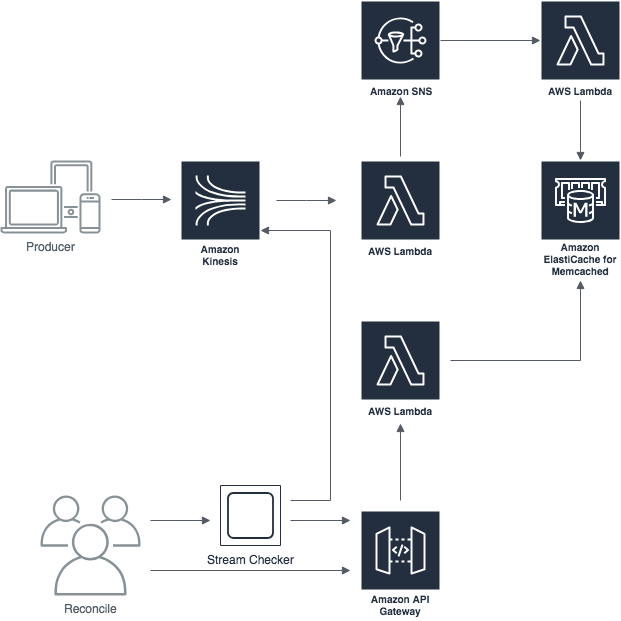

# streamwreck

Reconcile the records processed from a stream against those written to a stream.

## Overview

The following diagram shows the solution components.



In this pattern, a producer application writes events to a Kinesis stream, which are processed by a lambda function. The lambda function publishes an event indicating the record was processed. Another lambda which is subscribed to the 'event processed' topic writes an entry to ElastiCache for each stream record processed, using the sequence number to identity the record. Another lambda implements a simple API that takes an array of sequence numbers and indicates in its response any that have not been recorded as being processed in ElastiCache.

To reconcile the stream events against the processed events, a client can read the records from the stream, call the reconcilliation API, and determine which have events have not been processed.

This project provides:

* Cloud formation templates to instantiate all infrastructure needed to exercise this pattern
* A lambda function to simulate processing of events from the stream, producing notifications of processed records (the stream processor lambda). For this sample, Kinesis records evenly divisible by 5 are skipped, thus leaving unprocessed records that can be identified via the reconcilliation process.
* A lambda function that subscribes to the SNS notification topic, which records the processed records as key/value pairs in Elasticache (notified lambda).
* An API that takes a list of Kinesis sequence numbers and indicates which of those have not been processed (checker lambda). This API does a lookup of each record in Kinesis, using the sequence number as key.
* An executable process that reads the sequence numbers in the stream from the TRIM_HORIZON and calls the checker API to determine if they've been processed or not (stream checker)

## Limitations

There are likely several, but most notable is the use of the bare Kinesis sequence number as the look up key - these are only unique within a shard, so this example would need to be enhanced to reliably work in a multishard implementation (i.e. the real world).

## Alternatives

Many ways to do this - a simpler solution would be to write s3 objects into date partitioned folders instead of elasticache. You could also write records of what was processed into redshift, and do a firehose from the stream into redshift and reconcile records using a query. Or go s3 and use Athena to query, or...

## Notes

Create the vpc: 

```console
aws cloudformation create-stack --stack-name myvpc --template-body file://cfn/vpc.yml
```

Deploy the memcached stack:

```console
aws cloudformation create-stack --stack-name mycache --template-body file://cfn/cache.yml
```

Build and deploy the lambdas:

```console
make
make deploy
```

Write records to yonder stream:

```console
aws kinesis put-record --stream-name WreakStream-Dev --data Data1234Foobar --partition-key foo
```

Get logs

```console
sam logs -n StreamProcessor --stack-name streamwreck
```

List APIs

```console
aws apigateway get-rest-apis
{
    "items": [
        {
            "id": "0gs925saae",
            "name": "streamwreck",
            "createdDate": 1546272932,
            "version": "1.0",
            "apiKeySource": "HEADER",
            "endpointConfiguration": {
                "types": [
                    "EDGE"
                ]
            }
        }
    ]
}
```

List stages for the API

```console
aws apigateway get-stages --rest-api-id 0gs925saae
```

With the rest id and stage, you can form the endpoint as https://{api id}.execute-api.{region}.amazonaws.com/{stage}/reconcile

For example:

```console
curl https://0gs925saae.execute-api.us-east-1.amazonaws.com/Stage/reconcile -d '["49591585917767627211020937568791696204996217827017883650", "49591585917767627211020937568796531908274676481155661826", "49591585917767627211020937568800158685733520506118733826"]'
```

Run the stream checker to check all records from the TRIM_HORIZON to see if they've been processed:

```console
go run streamchecker/main.go --stream WreakStream-Dev --endpoint https://hyqj92kmud.execute-api.us-east-1.amazonaws.com/Stage/reconcile
```

## TODOs

* redo API to use Api resource not function with http event
* export the relevant api gateway resources to avoid having to look up the endpoint via cli calls